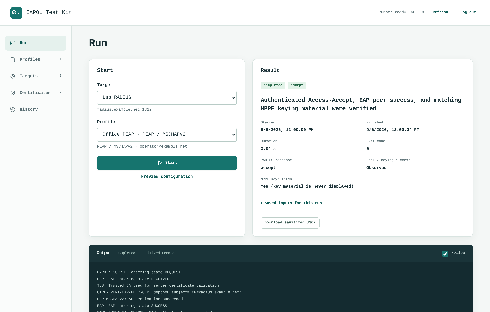

# EAPOL Test Kit

A web UI for testing RADIUS/EAP authentication with `eapol_test`.



Save RADIUS targets and EAP profiles, import or generate certificates, and inspect
authentication results. Includes presets for EAP-TLS, PEAP-MSCHAPv2, TTLS-PAP, and
TTLS-MSCHAPv2.

Designed to run in Docker on Debian. You need a separate RADIUS server; FreeRADIUS
is not included.

## Quick start

Install Git, Docker Engine, and the Docker Compose plugin on your Debian host,
then run:

```sh
git clone https://github.com/clankerwrangler/eapol-test-kit.git
cd eapol-test-kit
docker compose up --build -d
```

Open http://127.0.0.1:8080 and create a password for the web UI. This is separate
from your RADIUS credentials.

The UI is only exposed on localhost by default. To connect from another machine,
see [Remote access](#remote-access).

## Run an authentication test

Before testing, configure your RADIUS server to recognize the kit as a client,
using the correct [source address](#radius-client-address) and shared secret.

1. Add a RADIUS target with the server address, UDP port, and shared secret.
2. Import the CA certificate or chain that validates the RADIUS server.
3. Create a profile using one of the EAP presets.
4. Set the identity, expected server certificate name, and the credentials or
   client certificate required by your EAP method.
5. Check the generated configuration preview, select the target and profile,
   and start the test.

Targets and profiles are saved separately, so you can test the same profile
against different servers. A target holds the server connection details and NAS
settings. A profile holds the EAP method, identity, credentials, certificates,
Calling-Station-Id, and extra RADIUS attributes.

Custom attributes support text, unsigned integers, hex bytes, and IPv4 addresses.
For hex input, enter the attribute payload without the type/length header.

### RADIUS client address

With Docker's default bridge networking, the RADIUS server usually sees packets
coming from the Debian host's outbound IP address. Register the address the server
actually sees, along with the shared secret.

`NAS-IP-Address` is an attribute inside the RADIUS packet. Changing it does not
change the packet's source IP.

## Results

Each run records its outcome and logs. Results distinguish authentication
acceptance or rejection from certificate errors, timeouts, and other failures.
An accept result requires completed EAP processing, not just a RADIUS
Access-Accept response.

Only one test runs at a time. You can cancel a running test. If the container
restarts, unfinished tests are marked as interrupted and are not rerun.

## Certificates

Server trust and client identity serve different purposes:

- **Server trust:** Import a PEM CA certificate or chain to verify the RADIUS
  server. Set the expected server certificate name in the profile.
- **Client identity:** For EAP-TLS, import a client certificate with its matching
  private key, or a passphrase-protected PKCS#12/PFX bundle.

To use an existing PKI, generate a key and CSR in the kit, have the CSR signed,
and import the signed certificate to complete the saved request.

For lab testing, you can generate a CA and issue client certificates in the kit.
You still need to configure your RADIUS server to trust that CA.

Certificate and CSR downloads do not include private keys. To export a client
certificate with its private key, use a passphrase-protected PFX export.
Passphrases supplied during import are not saved.

## Remote access

### SSH tunnel

Start the kit on the Debian host using the quick-start commands. On your own
machine, run:

```sh
ssh -L 8080:127.0.0.1:8080 YOUR_SSH_USER@YOUR_DEBIAN_HOST
```

Open http://127.0.0.1:8080 locally and keep the SSH session open. This lets you
use the UI without exposing its port on the remote host's network interfaces.

### Direct access on a host IP

**Direct access uses unencrypted HTTP. Passwords and other sensitive data are
not encrypted in transit. Do not expose this HTTP endpoint to the public
internet.** Use an SSH tunnel or HTTPS reverse proxy for encrypted access.

Create a `.env` file in the repository directory, replacing `YOUR_HOST_IPV4`
with an IPv4 address already assigned to the Debian host:

```dotenv
EAPOLKIT_BIND_ADDRESS=YOUR_HOST_IPV4
```

For a new installation, set the UI password before opening the web port. Run
these commands in an interactive terminal on the Debian host:

```sh
docker compose build &&
docker compose run --rm --no-deps kit python -m eapolkit.setup &&
docker compose up -d
```

Enter the password twice. Input is hidden. The setup command does not publish
ports and leaves any existing password unchanged.

If the data volume already has a password, start the kit with:

```sh
docker compose up --build -d
```

Open `http://YOUR_HOST_IPV4:8080` and sign in. Your network and firewall must
allow access to that address and port. Set `EAPOLKIT_PORT` in `.env` to use a
different host port.

### HTTPS reverse proxy

For a new installation, initialize the password with the terminal setup command
above before making the UI available through a proxy.

Configure your reverse proxy to forward requests to the kit, and set
`EAPOLKIT_SECURE_COOKIES=1`. Set `EAPOLKIT_ALLOWED_HOSTS` to the hostnames used to
access the UI, including `127.0.0.1` for the container health check. A nonempty
value replaces the default allowed hosts.

Without that override, the kit accepts `localhost`, `127.0.0.1`, `::1`, and the
concrete IP set in `EAPOLKIT_BIND_ADDRESS`. Binding to `0.0.0.0` or `::` does not
allow additional HTTP hosts.

The kit does not configure the proxy or provide HTTPS certificates.

## Data and security

Targets, profiles, certificates, credentials, and run history are stored in a
named Docker volume. They survive container restarts and recreation.

RADIUS credentials and private keys are encrypted at rest. The encryption key
is stored in the same volume, so protect your backups: a copy containing both
the data and the key can be decrypted. Host administrators have access to both.

Stored logs, configuration previews, and run reports redact secret values.

**`docker compose down -v` deletes the data volume, including saved profiles,
credentials, certificates, and run history.**

## Development

See the [technical specification](docs/technical-specification.md) for API and
behavior details, and [runtime verification](runtime/VERIFICATION.md) for the
tested environment and image verification details.

## License

The kit's original code and documentation use the [MIT license](LICENSE).

The upstream wpa_supplicant code and native patches retain their BSD-3-Clause
terms. See [Third-party notices](THIRD_PARTY_NOTICES.md) for the applicable
licenses and notices.
